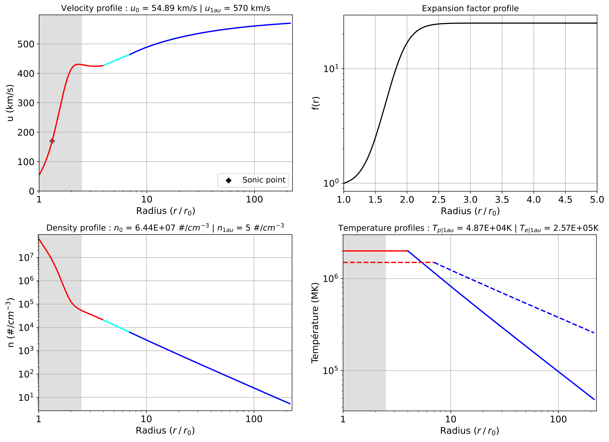

## ParkerSolarWind

This repository complete and extend the one with the exact same name that can be found at [https://github.com/STBadman/ParkerSolarWind](https://github.com/STBadman/ParkerSolarWind). 
It contains Python code which solves two-fluids hydrodynamic solar wind equations, for a 1D radial trans-sonic flow in spherical expansion, including super-radial expansion, based on Eugene Parker's theory of the solar wind ([Parker 1958](https://ui.adsabs.harvard.edu/abs/1958ApJ...128..664P/abstract), [Parker 1960](https://ui.adsabs.harvard.edu/abs/1960ApJ...132..821P/abstract)) and expansion factor modeling ([Kopp & Holzer 1976](https://ui.adsabs.harvard.edu/abs/1976SoPh...49...43K/abstract)).

This code follows the recent "isopoly" resolution by [Dakeyo et al. (2022)](https://ui.adsabs.harvard.edu/abs/2022ApJ...940..130D/abstract), which model an isothermal evolution close to the Sun, followed by a polytropic evolution somewhere above the critical radius. It also include the extension of the isopoly equations by [Dakeyo et al. (2024b)](https://ui.adsabs.harvard.edu/abs/2022ApJ...940..130D/abstract) accounting for the expansion factor modeling in the near Sun region, and the resulting "f-subsonic" and "f-supersonic" solutions, respectively subsonic and supersonic in the super-expansion region. This degeracy of solution is due to the deLaval nozzle effect applied on wind expansion ([Kopp & Holzer 1976](https://ui.adsabs.harvard.edu/abs/1976SoPh...49...43K/abstract), that induces two possible critical radius values for a single coronal temperature value. 

There are three main files here `function_iso_poly_dakeyo2024b`, `run_and_plot_function_iso_poly_dakeyo2024b` and `main_iso_poly_dakeyo2024b` . The former contains the functions to solve the equations themselves, the second file runs the solving and plots the solution, and a later is the main code for user, which takes the inputs of the model, run the two first files to display the solutions and provide the output isopoly parameters. The equations are solved by a finite difference scheme (explicit method). 
The combination of input parameters results in three different possible thermal regimes :

* A fully isothermal solar wind ($\gamma_p =  \gamma_e = 1$) <details><p> - This follows [Parker 1958](https://ui.adsabs.harvard.edu/abs/1958ApJ...128..664P/abstract), in which the solar wind fluid is held at a fixed temperature. Mass flux conservation results in a negative density gradient and in turn an outwards directed pressure gradient force. For sufficiently hot $T_0$, this outwards force outcompetes gravitation, resulting in a trans-sonic solar wind flow out to infinity. While such a constant temperature is non-physical in the heliosphere, it is a reasonable first approximation to behavior in the solar corona where coronal heating operates.</p></details>
* A two fluid isopoly solar wind with single transition ($\gamma_p$ and/or $\gamma_e \neq 1$,  with  $r_{iso|p} = r_{iso|e}$) <details><p> - Here, the solar wind temperature is allowed to cool with heliocentric distance, as is observed to actually occur in the solar wind (e.g. [Dakeyo et al. (2022)](https://ui.adsabs.harvard.edu/abs/2022ApJ...940..130D/abstract). 
This consists of an initial isothermal evolution (isothermal layer) out to some boundary distance called the "isothermal radius" $r_{iso}$, which can nominally be interpreted as defining a corona as the region in which coronal heating (as an abstract physical process) operates. In this solution case, both protons and electrons share the transition, i.e. $r_{iso} = r_{iso|p} = r_{iso|e}$. 
For $r \gt r_{iso}$, the solar wind is constrained to follow a polytropic evolution which is initialized by the outer boundary conditions of the isothermal region. Protons and electrons can follow differentiate polytropic evolution ($\gamma_p \neq \gamma_e$ is possible). 
For most combinations of physical conditions, the trans-sonic critical point is located within the isothermal region. As long as the isothermal boundary is sufficiently high that the solar wind stays super-sonic at the (unphysical discontinuity) transition to polytropic behavior, the solution remains on the asymptotically accelerating solution branch and a reasonable solar wind solution is obtained. The transition can be smoothed (no discontinuity anymore) considering slowy varying polytropic indixes at the transition between the two regions, but this feature is not adressed here and may required deepest work. </details></p> 
* A two fluid isopoly solar wind with double transition ($\gamma_p$ and/or $\gamma_e \neq 1$,  with  $r_{iso|p} \neq r_{iso|e}$) <details><p> - This case is closely similar to the single transition solution, at the difference that protons and electrons do not share the same isothermal radius. </details></p>

All the thermal regimes can be declined in both "f-subsonic" and "f-suersonic" type of solutions, depending the influence of the expansion factor profile. More details available in [Dakeyo et al. (2024b)](https://ui.adsabs.harvard.edu/abs/2022ApJ...940..130D/abstract) 


Since all solutions are computed with the same set of functions, each of the above solutions can be obtained by modifying the inputs parameters. The `main_iso_poly_dakeyo2024b` code returns an array of heliocentric distances ($r$), density ($n$), fluid velocity ($u$), fluid temperatures ($T_p$ and $T_e$), expansion factor profile ($f$) and a bolean mentionning if this is a "f-supersonic" type solution (bol_super=0 $\rightarrow$ f-subsonic, bol_super=1 $\rightarrow$ f-supersonic).  As well, any parameters that went into the solution are returned as "inputs".

All the outputs are `numpy array`. 

Units are tracked with `astropy.units` and the outputs of the above functions are `astropy.units.Quantity` objects.

`plot_parkersolarwind` subsequently contains plotting functions which are expecting these same output arrays and parameters. 

In the following example, we solve and plot an isopoly solution :

```python
# Importation required to run this code
import isopoly_solar_wind_solve_and_plot as ipsw

#########################################
# Inputs of the model 
#########################################

# Length of the output model
N = 7e4
L = 1.496e11      # set to 1au by default

# Polytropic ind
gamma_p_max = 1.45
gamma_e_max = 1.25

# Coronal temperature
Tp0 = 2e6
Te0 = 1.5e6

# Isothermal radius (in solar radii)
r_iso_p = 4 
r_iso_e = 7 

# Expansion factor parameters
fm = 25
r_exp = 1.9          # in solar radii
sig_exp = 0.15       # in solar radii
#########################################
# Plotting option 
plot_f = True
plot_gamma = False

plot_speed = True
plot_density = True
plot_temp = True
plot_energy = False
#########################################

###############################################################
# Running of the main function
(r, n, u, Tp, Te, gamma_p, gamma_e, f, bol_super) = ipsw.solve_isopoly(
                                        N, L, gamma_p_max, gamma_e_max, 
                                        Tp0, Te0, r_iso_p, r_iso_e,
                                        fm, r_exp, sig_exp, plot_f, 
                                        plot_gamma, plot_speed, 
                                        plot_density, plot_temp, plot_energy)
###############################################################
```


Examples for all the thermal regimes and types of solution (f-subsonic and f-supersonic) can be seen in `ExampleNotebook.ipynb`


A new set of example plots is appended to [ExampleNotebook.ipynb](https://github.com/STBadman/ParkerSolarWind/blob/main/ExampleNotebook.ipynb) to illustrate these updates. 
